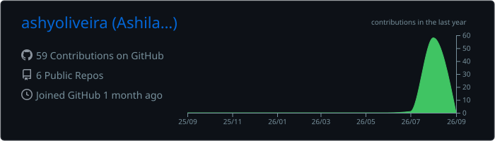

<div align="center">


### 👋🏾 Hi, I'm Ashilay!

`Systems Information` • `Technology` • `Data` • `Infrastructure`

<br>

</div>

## 👩🏾‍💻 About Me

Olá! Eu sou **Ashilay Oliveira**.

Sou estudante de **Sistemas de Informação** e venho construindo minha trajetória explorando diferentes áreas da tecnologia, passando por desenvolvimento, dados, infraestrutura e gestão.

Tenho curiosidade em entender não apenas como uma tecnologia funciona isoladamente, mas como diferentes soluções podem se conectar para resolver problemas reais.

Este GitHub é um espaço para registrar meus estudos, experimentos e minha evolução técnica ao longo dessa jornada.

<br>

## 🛠️ Tech Stack

<div align="center">

### Languages


<br><br>

### Front-end


<br><br>

### Tools


</div>

<br>

## 💜 Technologies & Infrastructure

<div align="center">


</div>

<br>

## 📊 GitHub Overview

<div align="center">



</div>

<br>


## 📚 Currently Learning

```text
◦ Software Development
◦ Infrastructure & Networks
◦ Cloud Computing
◦ Data & Observability
◦ Solution Architecture
```

<br>

## ✦ Beyond the Code

<div align="center">

### Technology • Leadership • Creativity

I believe technology goes beyond writing code.

I'm interested in understanding how **people, processes and technology**
can work together to transform ideas into solutions.

**Curiosity → Learning → Building → Evolution**

</div>

<br>

## 🤝 Let's Connect

<div align="center">

[](https://www.linkedin.com/in/ashilay-oliveira/)

[](mailto:ashilaydeoliveira@gmail.com)

[](https://github.com/ashyoliveira)

</div>

<br>

<div align="center">

### ✦ Thanks for visiting!

`Always learning • Always building`

</div>
